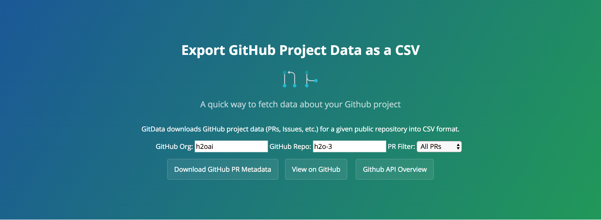

GitData
=======


**GitData** is a library (written in Typescript, HTML, and CSS) that helps software teams understand their GitHub project data (PRs, issues, milestones, etc.), which is quite useful when it comes to planning for releases.

Building & Running GitData
===========================
The following shell script will transpile the TypeScript source code (`gitdata.ts`) to JavaScript(`gitdata.js`) and start up the `GitData` library in your default browser (Chrome, Firefox, etc.):

```
bash run_gitdata.sh
```
